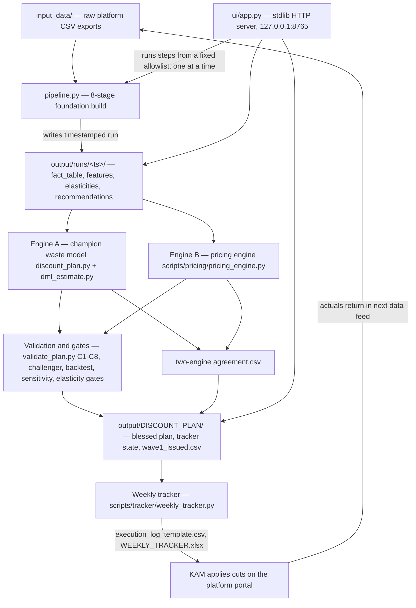

# 10 — System Architecture

**Audience:** engineers new to the repo.
**Scope:** the overall shape — two engines, orchestration, the file-based data layer, the dashboard, and the safety/governance layer. Deep dives into individual stages and scripts live in the sibling `docs/TECHNICAL/` docs.

Stat IQ Lab — Optimal Price Finder is a **local-only pricing engine for CPG brands on quick-commerce**. Everything runs on one Windows machine from the repo root: a Python 3.12 venv (`.venv`, pinned `requirements.txt`), plain files on disk, and a stdlib HTTP dashboard on `127.0.0.1:8765`. There is **no database, no cloud service, no auth layer, and no deployment pipeline** — those absences are deliberate, and each has a real equivalent described below.

The current engagement is **Epigamia on Blinkit**. Brand and platform are *settings*, never hardcoded: `config/settings.xlsx` carries `BRAND_NAME` / `PLATFORM_NAME`, loaded by `settings_loader.py`, which raises `SettingsError` on any bad value (fail-loud by design). The latest full run is `output/runs/20260810_143823` — 699 modeled cells across 8 categories.

## The system at a glance

## The two-engine design

The system deliberately computes its money answer twice, with independent methods, and only acts where they agree:

- **Engine A — the champion waste model** (`scripts/analysis/discount_plan.py`). A confounder-controlled weekly product×city panel model, pooled per category with cell fixed effects (MODEL v2.1: `log1p(units) ~ C(cell) + disc + rpi_w + comp controls + C(month)` — see the module docstring). It isolates the discount coefficient with availability (OSA), ad share-of-voice, and competitive intensity held constant, buckets every cell (stock problem / defensive / genuine waste / test-trim / protect), and computes break-even discounts. Its verdict is then independently confirmed by **Double ML** (`scripts/analysis/dml_estimate.py`) — a causal cross-check that the waste finding is not correlation.
- **Engine B — the pricing engine** (`scripts/pricing/pricing_engine.py`). Elasticities plus an optimizer, extended by `budget_allocator.py` (marginal-ROI waterline at the 12% spend cap), `scenario_menu.py`, and `budget_glide.py`.

Where they overlap, agreement is written to a `two-engine agreement.csv` that the weekly tracker requires before recommending a cut. A challenger model (`scripts/analysis/challenger.py`) tests whether competition explains the apparent waste; defense holds are honored only when they come from a credible Model B.

## Orchestration

There is no workflow engine. Orchestration is two thin layers:

1. **`pipeline.py`** — the master orchestrator for the foundation build. It runs stages 1–8 in order (`stage1_ingestion` … `stage8_output`), passing a `context` dict between stages and writing artifacts into a fresh timestamped run directory under `output/runs/` (`v4_config.OUTPUT_DIR`). `python pipeline.py --stages 1 2 3` runs a subset. Notable stage facts:
   - Stage 1 ingests raw sales, the event calendar, and master costs (`stage1_ingestion/ingest.py`); input validation fails loud (`stage1_ingestion/validate.py`).
   - Stage 2 builds `fact_table.csv` and then **drops the raw all-brand frame from memory** — the machine has 5.9 GB RAM (~1 GB free), and freeing the largest object before Stage 4's fits was a real fix, not hygiene.
   - Stage 4 (`stage4_model/elasticity.py`) fits per-category fixed-effects regressions with a Huber robust option. When the cell-dummy matrix would exceed a 32 MB budget (`_FE_DUMMY_BUDGET_MB`), `_fit_category` switches to `_fit_category_within` — the within/FWL transform, which absorbs cell effects by demeaning and yields identical OLS coefficients at a fraction of the memory.
   - Stage 7 writes `recommendations.csv` with `product_id` and `cell_id` leading the column order, and triggers dashboard generation.
2. **The Run Center in `ui/app.py`** — a fixed `STEPS` allowlist that encodes the full monthly analysis chain in its blessed order (`MONTHLY_ORDER`): `pipeline.py` → `discount_plan.py` → `dml_estimate.py` → `validate_plan.py` → `challenger.py` → `pricing_engine.py` → `budget_allocator.py` → `promo_calendar_milp.py` → `scenario_menu.py` → `budget_glide.py` → `backtest_rolling.py` → `elasticity_gates.py` → `sensitivity.py` → `outlier_promo_audit.py`, plus the weekly tracker steps and a governance parameter review (`scripts/tracker/params_review.py`).

Every analysis script is independently runnable from the repo root; each locates the newest run itself (e.g. `_latest_facttable()` in `discount_plan.py` scans `output/runs/2026*`). The "message bus" between components is the filesystem.

## The data layer: files, not a database

There is **no database**. The real equivalent is a disciplined file layout:

| Location | Role | Mutability |
|---|---|---|
| `input_data/` | Raw platform CSV exports — the only entry point for truth | Append-only (new monthly feeds) |
| `config/settings.xlsx` | All engagement knobs (brand, platform, caps, dates) | Edited by the operator; validated fail-loud on load |
| `output/runs/<timestamp>/` | One immutable folder per pipeline run: `fact_table.csv`, `features.csv`, `elasticity_estimates.csv`, `recommendations.csv`, `plan/` (cut/reinvest lists, `dml_results.json`, gate receipts) | Write-once; runs never overwrite each other |
| `output/DISCOUNT_PLAN/` | The blessed current plan, tracker state, and issued waves (e.g. `wave1_issued.csv` — Mon 17 Aug: 7 cuts + 15 tests) | The one folder the tracker and KAM handoff work from; the only `output/` subtree tracked in git |
| `output/` (rest) | Delivered workbooks and reports | Git-ignored; **versioned, never overwritten** |

Two conventions substitute for database guarantees:

- **Timestamped runs = transactions.** A run either completes into its own folder or is discarded; consumers always resolve "latest complete run" themselves.
- **Versioned deliverables = immutable history.** `scripts/reports/build_stage_workbook.py::_next_versioned_out` writes `STATIQ_STAGE_REPORT_v<N+1>.xlsx` on every build — a delivered file is never modified.

Every generated table leads with `product_id` (and `cell_id`) so any row is joinable back to the catalog without guessing.

## The dashboard

`ui/app.py` is a zero-extra-dependency web server (stdlib `http.server` + pandas) serving the single page `ui/index.html`. Start it with `launch_ui.bat` at the repo root or via `.claude/launch.json`; port is `UI_PORT`, default 8765.

Security model — the real equivalent of "no auth":

- Binds to `127.0.0.1` only. Nothing off-machine can reach it.
- The run endpoint accepts **only step ids from the fixed `STEPS` allowlist** — never arbitrary commands.
- One job at a time (a single in-memory `Job` with a lock), with live log streaming.

The dashboard's read path has one hard rule: **stale receipts are bugs**. Every headline it shows is read from the *current* run's artifacts — e.g. the Double ML verdict is re-read from `<run>/plan/dml_results.json` on each request precisely because a cached verdict once went stale across engagements (fixed in `ui/app.py`, `_dml()` around line 294). The rolling backtest writes a report even when it FAILs, so the dashboard can honestly display FAIL (today it does: the backtest needs 12 training weeks and the feed has 10) rather than showing the last success.

## The safety / governance layer

Safety is layered, and each layer is code, not policy prose:

1. **Fail-loud inputs.** `settings_loader.py` raises on any malformed setting at import; `stage1_ingestion/validate.py` rejects bad feeds before they can poison a run.
2. **Acceptance gates.** `scripts/analysis/validate_plan.py` runs hard pass/fail gates C1–C5, C7, C8 (C6 was removed by design); a plan must end ALL PASS. Independent validators pile on: rolling backtest, 3-stage elasticity gates (currently 3/3 PASS, OOS R² 0.965 on 5/5 categories), 200-draw sensitivity shake (currently 0 fragile decisions), and an outlier-vs-promo audit.
3. **Six weekly controls.** The tracker only issues a cut under: two-engine agreement, no defense hold, hero SKUs protected (`STRATEGIC_SKUS`), glide limit of max 3 ppt/week, the 12% budget cap, and a kill-switch — 2 weekly misses worse than 5% auto-reverts the cut.
4. **Two deliberate reporting policies** (design decisions, enforced in code):
   - **No savings target anywhere.** The engine reports confident amounts with spend-share context (currently Rs. 90,402/mo of DML-locked waste across 7 Protein Milkshake cells; Rs. 8.0L/mo staked in the test queue); it never grades sufficiency — see the tunables comment block in `discount_plan.py`.
   - **No COGS/margin in user-facing surfaces.** Only observable, revenue-space numbers are shown; internal cost knobs exist solely as guardrails.
5. **Governance cadence.** `scripts/tracker/params_review.py` snapshots every decision knob and shows drift since the last sign-off.

## Runtime environment and constraints

- **Python 3.12 venv** at `.venv`, dependencies pinned in `requirements.txt`. All commands are run from the repo root (`D:\1. PROJECT\Stat IQ Lab`); scripts insert the repo root onto `sys.path` themselves, so they also work when invoked by absolute path.
- **Memory is the binding constraint**: 5.9 GB RAM with roughly 1 GB free in practice. This shaped real code, not just comments — the `context.pop("raw_df")` after Stage 2 in `pipeline.py`, the 32 MB dummy-matrix budget and within/FWL fallback in `stage4_model/elasticity.py`, and the bounded in-memory log (`deque(maxlen=6000)`) in `ui/app.py` all exist because of it.
- **Windows-first**: `launch_ui.bat` is the operator's entry point; the dashboard runs with `python -X utf8` to keep console output sane.
- **Tests**: `pytest tests/ -m "not slow"` — 67 passing. There is no CI runner; tests are run locally before committing.
- **Scale reference** (latest run `output/runs/20260810_143823`): 699 modeled cells, 8 categories, 423/699 cells availability-constrained (flagged as stock problems, never cut).

## What deliberately does not exist here

| Classic concept | Status | Real equivalent |
|---|---|---|
| Database | None | Timestamped run folders + the `DISCOUNT_PLAN/` blessed shelf (see data layer above) |
| Cloud / deployment | None | Everything runs locally from the repo root; git push to remotes is the backup story |
| Auth | None | Loopback-only binding + a command allowlist + single-job serialization |
| CI/CD | None | `pytest tests/ -m "not slow"` (67 passing) run locally; gates C1–C8 act as the release check for *plans* rather than code |
| Message queue | None | The filesystem: producers write run artifacts, consumers resolve the latest run |

## Related reading

- `docs/BUSINESS/04-business-architecture.md` — the same system explained for the business owner.
- `docs/BUSINESS/03-business-logic.md` — what the models estimate and why the gates exist.
- `docs/reference/ARCHITECTURE_HANDBOOK.md` — a from-first-principles teaching handbook of this architecture. **Caution: it predates the Epigamia engagement** — it names 24 Mantra Organic as the brand and `v4_outputs/` as the run directory (now `output/runs/`, per `v4_config.OUTPUT_DIR`). Its layered explanations remain accurate; verify any concrete path or brand name against the code.
- Sibling `docs/TECHNICAL/` docs — per-layer deep dives (pipeline stages, analysis chain, dashboard internals, weekly loop).
