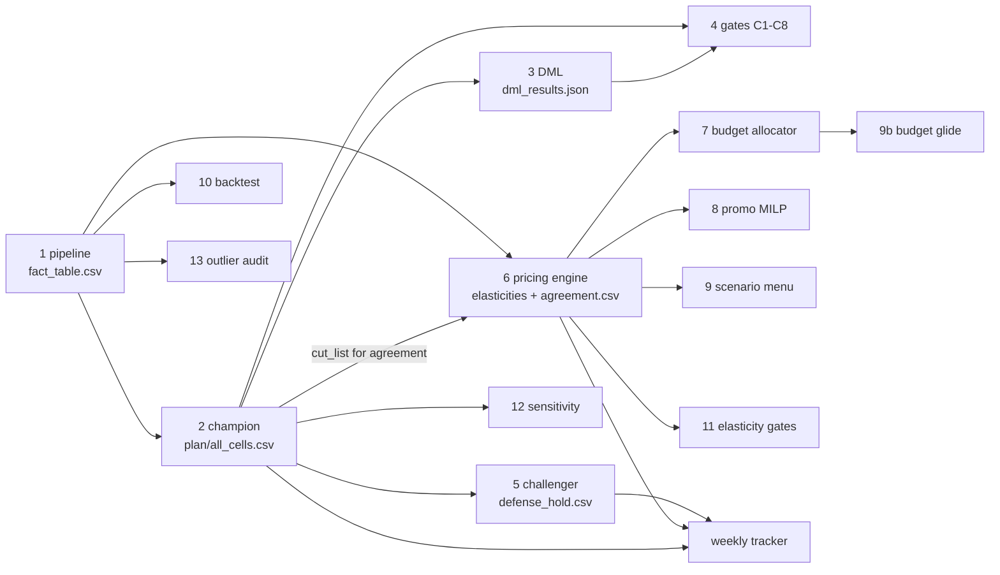

# 11 — Application Flow

**Audience:** engineers new to the repo.
**Scope:** the exact execution order — the 13-step monthly rebuild, the weekly A/B/C loop, and the ad-hoc issuance/governance steps — with what each step reads and writes, and rough runtimes on the actual hardware (a Windows laptop with 5.9 GB RAM, ~1 GB free). For the overall shape of the system see [10-system-architecture.md](10-system-architecture.md); for file lineage and CSV schemas see [12-data-flow.md](12-data-flow.md).

There is **no scheduler, no cron, no CI trigger**. The flow is executed one of two ways, both equivalent:

- **Run Center** (`ui/app.py`, served at `127.0.0.1:8765`): every step below is a button. The allowlist `STEPS` dict and `MONTHLY_ORDER` list in `ui/app.py` *are* the canonical execution order — the dashboard can only run these exact commands, one job at a time. A `monthly_all` meta-step runs all 13 monthly steps in sequence.
- **Terminal**: each script is independently runnable from the repo root with `python -X utf8 <script>`. Every script locates the newest run under `output/runs/2026*` by itself, so order matters but no arguments need to be passed between steps.

Convention used below: `<run>` = the newest timestamped folder under `output/runs/` (currently `output/runs/20260810_143823`), `DP/` = `output/DISCOUNT_PLAN/`.

## The monthly rebuild — 13 steps, in order

Run when a new monthly platform export lands in `input_data/`. The order is not stylistic: steps 2–13 all consume step 1's run folder, steps 3–5 consume step 2's plan, and the weekly tracker refuses to cut without the artifacts steps 5 and 6 produce.

| # | Step (Run Center label) | Command | Reads | Writes |
|---|---|---|---|---|
| 1 | Build foundation (pipeline) | `pipeline.py` | `input_data/*.csv`, `config/settings.xlsx` | new `<run>/`: `fact_table.csv`, `features.csv`, `elasticity_estimates.csv`, `recommendations.csv`, `waste.csv`, `reinvest.csv`, `outliers_removed.csv`, `per_cell_detail.json`, `BRAND_DASHBOARD.html`, `WASTE_REINVEST_REPORT.{md,xlsx}` |
| 2 | Champion waste model | `scripts/analysis/discount_plan.py` | `<run>/fact_table.csv`; raw `input_data/*.csv` (competitor rows for the RPI) | `<run>/plan/`: `all_cells.csv`, `cut_list.csv`, `reinvest_list.csv`, `plan_summary.json`, `MEASUREMENT_SPEC.md`, `DATA_GAPS.md` |
| 3 | Double ML confirmation | `scripts/analysis/dml_estimate.py` | the champion's weekly panel (rebuilt via imported `discount_plan` code) | `<run>/plan/dml_results.json` |
| 4 | Acceptance gates C1–C8 | `scripts/analysis/validate_plan.py` | `<run>/plan/` (`all_cells.csv`, `cut_list.csv`, `plan_summary.json`) | console PASS/FAIL report; exit 0 iff all safety gates pass (C1–C5, C7, C8 — **C6 removed by design**, see below) |
| 5 | Competitor challenger | `scripts/analysis/challenger.py` | champion panel + `DP/competitor_features.csv` | `DP/CHALLENGER_REPORT.md`, `DP/defense_hold.csv` |
| 6 | Pricing engine | `scripts/pricing/pricing_engine.py` | `<run>/fact_table.csv` (via `pricing_panel`), `<run>/plan/cut_list.csv` | `DP/pricing/`: `elasticities.csv`, `cross_price.csv`, `pricing_reco.csv`, `gates.json`, `agreement.csv`, `PRICING_PLAN.md` |
| 7 | Budget allocator | `scripts/pricing/budget_allocator.py --budget_pct 0.12` | `DP/pricing/elasticities.csv`, `cross_price.csv`, the pricing panel | `DP/pricing/`: `roi_ladder.csv`, `budget_allocation.csv`, `BUDGET_PLAN.md` |
| 8 | Promo calendar (MILP) | `scripts/promo/promo_calendar_milp.py` | pricing panel + elasticity matrix; rules in `scripts/promo/promo_constraints.json` | `DP/promo/`: `promo_calendar.csv`, `promo_solver_report.csv`, `PROMO_CALENDAR.md` |
| 9 | Scenario menu | `scripts/pricing/scenario_menu.py` | same optimizer stack, read-only; optional `DP/pricing/negotiation_feedback.csv` | `DP/pricing/`: `scenario_menu.csv`, `SCENARIO_MENU.md`, `scenarios/round_<NN>/reco_<scenario>.csv` |
| 9b | Budget glide ladder | `scripts/pricing/budget_glide.py` | elasticity posteriors + `roi_ladder.csv` + shared demand kernel | `DP/pricing/`: `budget_glide.csv`, `budget_glide_cells.csv`, `BUDGET_GLIDE.md` |
| 10 | Rolling backtest | `scripts/validation/backtest_rolling.py` | `<run>/fact_table.csv` (champion imported read-only, refit per origin) | `DP/validation/`: `backtest_folds.csv`, `BACKTEST_REPORT.md` (written **even on FAIL**) |
| 11 | Elasticity gates | `scripts/validation/elasticity_gates.py --report-only` | `DP/pricing/elasticities.csv`, `cross_price.csv`, `gates.json`, the pricing panel | `DP/validation/`: `elasticity_validation.json`, `ELASTICITY_GATES.md` |
| 12 | Sensitivity shake | `scripts/validation/sensitivity.py` | `<run>/plan/all_cells.csv` + champion coefficient uncertainty (fit once, read-only) | `DP/validation/`: `sensitivity_cells.csv`, `SENSITIVITY_REPORT.md` |
| 13 | Outlier vs promo audit | `scripts/validation/outlier_promo_audit.py` | `<run>/outliers_removed.csv`, festival/platform-event calendar from config | `DP/validation/`: `outlier_promo_audit.csv`, `OUTLIER_AUDIT.md` |

Step-by-step notes an engineer actually needs:

1. **`pipeline.py`** is the only step that *creates* a run folder (`time.strftime("%Y%m%d_%H%M%S")`). It chains `stage1_ingestion` → `stage8_output` in-process, passing a `context` dict; stage 2 drops the raw all-brand frame from memory before stage 4's fits (the RAM constraint is real). `--stages 1 2 3` runs a subset.
2. **`discount_plan.py`** (the champion, MODEL v2.1) builds a weekly product×city panel from `fact_table.csv` and fits one Huber-robust regression per category with cell fixed effects: `log1p(units) ~ C(cell_id) + disc + disc_sq + log_osa + log_adsov + rpi_w + log_comp_osa + log_comp_adsov + log_orgsov + lag1_lu + lag2_lu + C(month)`. The competitor relative price index (`rpi_w`) is mined directly from the **raw** `input_data/*.csv` exports (competitor brands from `COMPETITOR_BRANDS` in settings), because own category share proved to be a bad control. Its outputs go into the *same run folder* as step 1, under `plan/`.
3. **`dml_estimate.py`** re-estimates the discount effect per category with Double/Debiased ML (HistGradientBoosting nuisances, 5-fold cross-fitting, Neyman-orthogonal score) and writes the DML-locked verdict to `<run>/plan/dml_results.json` — the dashboard re-reads this file from the *current* run on every request (stale receipts are bugs).
4. **`validate_plan.py`** exits 0 iff C1–C5, C7, C8 all pass. There is deliberately **no C6** (achievable-vs-target): validity gates test whether the number is *true*, never whether it is *big* — sufficiency is a contract question. Any FAIL should stop the chain; the Run Center stops on a nonzero exit automatically.
5. **`challenger.py`** fits Model B (champion + competitor controls) and adopts its defense-hold list **only if Model B is credible** under a pre-registered rule (OOS R² ≥ 0.75, all category fits clear the floor, sane competitor sign). A non-credible Model B writes an *empty* `defense_hold.csv` — the hold list can never come from a broken model.
6. **`pricing_engine.py`** is the independent second engine (hierarchical/Bayes elasticities + differential-evolution optimizer + what-if). Crucially it writes `DP/pricing/agreement.csv` — the two-engine agreement interface the weekly tracker requires before any cut.
7. **`budget_allocator.py`** builds per-cell discount ladders (2.5 ppt steps to 45%) through the shared demand kernel (`de_optimizer.demand_model` — never a divergent copy) and greedily allocates the 12% spend cap to the highest marginal-ROI increments.
8. **`promo_calendar_milp.py`** solves a 12-week calendar per (category, city) with scipy's bundled HiGHS MILP (1% gap target, per-solve time limit). Advisory only — week-1 execution still goes through the champion's glide and the tracker.
9. **`scenario_menu.py`** re-runs the validated optimizer once per scenario (objective × constraint tightness) as a negotiation menu. It edits nothing the tracker consumes; `revenue_base` reproduces the champion so the menu is anchored, not a replacement.
10. **`backtest_rolling.py`** refits the champion's exact formula at ≥ 4 walk-forward origins and compares recursive 4-week forecasts against seasonal-naive and last-week benchmarks. It currently reports **FAIL honestly** — it needs 12 training weeks and the feed has 10 — and still writes the report so the dashboard shows FAIL instead of a stale pass.
11. **`elasticity_gates.py`** is the 3-stage hard acceptance protocol on the production elasticity matrix (holdout fit / sign-magnitude sanity / stability). Without `--report-only` it exits 1 on failure so a retrain could gate on it; the Run Center uses `--report-only` for human report runs. Currently 3/3 PASS.
12. **`sensitivity.py`** shakes elasticities, costs and volumes over 200 Monte-Carlo draws *without refitting* (analytic re-evaluation of the decision layer) and counts flipped cut decisions. Currently 0 fragile cells.
13. **`outlier_promo_audit.py`** cross-checks every spike the stage-2 z-filter removed against documented promos/festivals/platform events/stockouts. Advisory; always exits 0.

## The weekly loop — A/B/C

The weekly cadence closes the feedback loop between the model and what the key-account manager (KAM) actually executed. All three steps are the same orchestrator, `scripts/tracker/weekly_tracker.py`, in different modes (see `STEPS` in `ui/app.py`):

- **A — Recommend this week's cuts** (`weekly_tracker.py`, no args). Reads `<run>/plan/all_cells.csv`, `DP/pricing/agreement.csv`, `DP/defense_hold.csv`, and the persistent state (`DP/tracker_history.csv`, `DP/baselines.json`, `DP/execution_log.csv` if the KAM returned one). Applies the six controls — two-engine agreement, defense hold, hero-SKU protection (`STRATEGIC_SKUS`), glide ≤ 3 ppt/week, 12% budget cap, kill-switch — then appends this week's predictions to `tracker_history.csv` and writes the KAM handoff: `DP/execution_log_template.csv`, `DP/WEEKLY_TRACKER.xlsx`, `DP/WEEKLY_READOUT.md`.
- **B — Score last week vs actuals** (`weekly_tracker.py --actuals <fact_table>`). The Run Center resolves the `@latest_fact` placeholder to the newest run's `fact_table.csv`. Backfills actual units/net-revenue into `tracker_history.csv` (matched by `cell_id` + week, only for cells the execution log marks as applied), runs the kill-switch (2 weekly misses worse than 5% ⇒ revert the cut), and refreshes the scorecard in the workbook and readout.
- **C — Self-test the loop** (`scripts/tracker/verify_loop.py`). Simulates two weeks against a real historical week from the existing fact table and asserts `LOOP CLOSED: YES` (actuals filled, cells scored, scorecard populated). The Run Center then runs its `then` actions: `#reset_state` (deletes `tracker_history.csv`, `baselines.json`, `execution_log.csv`) and a fresh `weekly_tracker.py` run to restore the clean weekly state. Run C from the UI, not bare — bare `verify_loop.py` leaves simulated state behind.

## Outside the two cadences

- **Wave issuance** — `scripts/reports/build_wave_kam_sheet.py [--wave N]`: merges the tracker's governed cuts (`DP/execution_log_template.csv`) with the Unlock Pipeline's Wave-N test cells (shared loader from `build_stage_workbook.py`) into `output/WAVE<N>_KAM_SHEET_v<K>.xlsx` (versioned, never overwritten) plus the machine-readable issue log `DP/wave<N>_issued.csv` for the scorer. The currently issued wave (Mon 17 Aug) is 7 governed cuts + 15 tests.
- **Stage workbook** — `scripts/reports/build_stage_workbook.py`: the three-stage end-user workbook, written as `output/STATIQ_STAGE_REPORT_v<N+1>.xlsx` via `_next_versioned_out` (delivered files are immutable history).
- **Governance** — `scripts/tracker/params_review.py` (a Run Center button): snapshots every decision knob into `DP/params_history.json` / `DP/PARAMS_REVIEW.md` and shows drift since the last sign-off.

## Runtimes on this machine

Measured/observed on the actual 5.9 GB laptop (times move with data volume; treat unanchored rows as order-of-magnitude):

| Step | Rough runtime | Why |
|---|---|---|
| 1 pipeline.py | **~10 min** | full 8-stage build incl. per-category FE fits under the 32 MB dummy-matrix budget |
| 2 champion | ~1 min | 8 Huber regressions on a weekly panel |
| 3 DML | a few min | 2 gradient-boosted nuisances × 5 folds × 8 categories |
| 4 gates | seconds | reads the plan, checks conditions |
| 5 challenger | ~1–2 min | refits the champion formula + competitor term per category |
| 6 pricing engine | **~45 min** | elasticity estimation + differential-evolution optimization per (category, city) |
| 7 budget allocator | ~1–2 min | ladder evaluations through the shared kernel, no optimizer |
| 8 promo MILP | minutes | HiGHS per (category, city), 1% gap target with per-solve time limit |
| 9 scenario menu | **hours** at full effort; much faster with `--maxiter 20 --popsize 8` | one DE run per scenario per group. Note: the Run Center's button runs it at full effort (no flags) — use the terminal for the trimmed run |
| 9b budget glide | **~5–7 min** | one kernel evaluation per rung × mode + uncertainty band |
| 10 backtest | a few min | champion refit at each of ≥ 4 origins |
| 11 elasticity gates | ~1–2 min | holdout scoring + half-split refit for stability |
| 12 sensitivity | ~1 min | 200 analytic draws, no refits |
| 13 outlier audit | seconds | joins removed outliers against the event calendar |
| Weekly A / B | seconds | panel joins + Excel write |
| Weekly C | ~1–2 min | runs the tracker twice against historical data |

Practical budget for `monthly_all` from the Run Center: dominated by the pipeline (~10 min), the pricing engine (~45 min), and the full-effort scenario menu (hours) — plan for a half-day unattended, or run steps 1–8 + 9b–13 via the UI and the scenario menu separately in a terminal with the trimmed flags when the menu is only needed as a comparison artifact.

## Why the order is fixed — the dependency spine

The 13 steps are not a checklist; they form a dependency chain enforced only by convention (each script exits with an error if its input artifact is missing, e.g. `validate_plan.py` raises `SystemExit("No plan/ folder found — run discount_plan.py first.")`):

Practical consequences:

- **Steps 2 and 3 write into step 1's run folder** (`<run>/plan/`). Re-running the pipeline creates a *new* run folder, which instantly makes the old plan invisible to every "newest run" scan — so after any pipeline re-run, steps 2–13 must be repeated before the weekly tracker recommends anything.
- **Step 6 must follow step 2**: the agreement file is computed *against* the champion's cut list. Running the pricing engine against a stale cut list silently produces an agreement about the wrong plan — the reason `MONTHLY_ORDER` in `ui/app.py` is the only supported order.
- **Steps 10–13 are read-only validators**: they can be re-run any time without touching the plan, and re-running them is the correct response to "do I trust this number?".
- **Independent re-runs are safe** because no script edits its inputs; the only mutable state in the whole flow is the weekly tracker's ledger (`tracker_history.csv`, `baselines.json`, `execution_log.csv`).

## Failure behavior

- The Run Center runs commands sequentially and **stops the batch on the first nonzero exit** (`_run_commands` in `ui/app.py`), logging `FAILED <label> (exit <rc>)`.
- `validate_plan.py` and `elasticity_gates.py` (without `--report-only`) are the two steps whose exit codes are *meant* to stop you.
- Settings and input validation fail loud at the very start: a malformed `config/settings.xlsx` raises in `settings_loader.py` before any model runs; a bad feed is rejected by `stage1_ingestion/validate.py`.

## Related reading

- [10-system-architecture.md](10-system-architecture.md) — the overall shape and the two-engine design.
- [12-data-flow.md](12-data-flow.md) — where every file in this doc comes from and goes, with actual CSV schemas.
- `docs/BUSINESS/` — the same flow explained for the business owner (do not edit from here).
