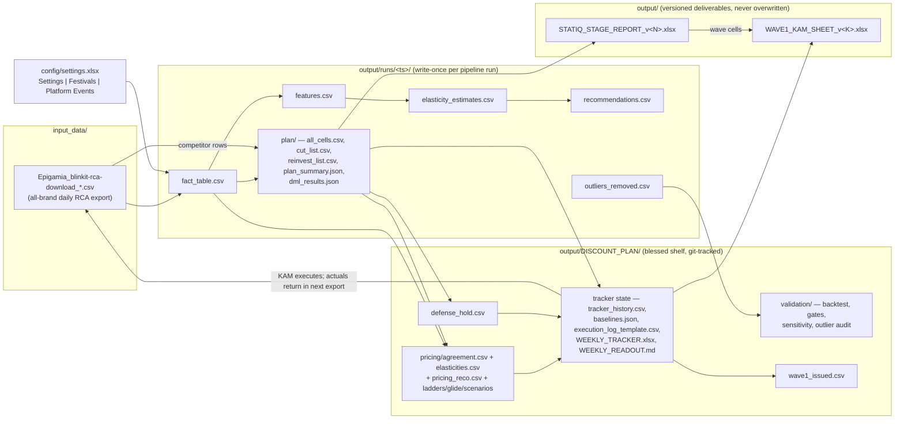

# 12 — Data Flow

**Audience:** engineers new to the repo.
**Scope:** file lineage — from the raw platform exports in `input_data/` through timestamped run folders to `output/DISCOUNT_PLAN/` and the versioned deliverables — plus the schemas of the key CSVs, taken from the actual file headers of the latest run (`output/runs/20260810_143823`). For *when* each file is produced see [11-application-flow.md](11-application-flow.md); for the overall architecture see [10-system-architecture.md](10-system-architecture.md).

There is **no database**: every hand-off between components is a file on disk, and every consumer resolves "the newest run" itself by scanning `output/runs/2026*`. All of `output/` is git-ignored **except** `output/DISCOUNT_PLAN/` (the blessed shelf) — see `.gitignore`.

## Lineage at a glance

The loop closes at the bottom left: the KAM applies the issued moves on the platform, the next weekly/monthly RCA export lands in `input_data/`, and the tracker's scoring step (`weekly_tracker.py --actuals`) backfills what actually happened.

## Stage 1: `input_data/` — the only entry point for truth

`Epigamia_blinkit-rca-download_{May,June,July}_2026.csv` — a daily **all-brand** market scan per (city, category, SKU). Actual header (38 columns incl. trailing blanks):

`Platform, Date, City, Category, Product ID, Product Title, Grammage, Brand, Item ID, Offtake (MRP), Offtake (SP), Est. Category Share, Est. Category Share (SP), Offtake (Qty), Overall SOV, Organic SOV, Ad SOV, Wt. OSA %, DS Listing %, Avg. OSA %, Avg. OSA % in LS, Wt. Discount %, Wt. PPU, MRP, Selling Price, Lifetime Avg. Rating, Lifetime Rating Count, Wt. OSA % in LS, Product_type, …`

Two independent readers consume the raw files:

- `stage1_ingestion/ingest.py` keeps the own-brand rows (fail-loud validation in `stage1_ingestion/validate.py`) for the pipeline.
- `scripts/analysis/discount_plan.py::_competitor_weekly` and `scripts/analysis/competitor_features.py` keep the **competitor** rows (brands from `COMPETITOR_BRANDS` in settings) — the source of the champion's `rpi_w` price index and of `DISCOUNT_PLAN/competitor_features.csv` (per category × city × ISO-week competitor pressure) that `challenger.py` consumes.

`config/settings.xlsx` (sheets Settings | Festivals | Platform Events) overrides `v4_config.py` defaults at import time via `settings_loader.py`; unknown keys are an error, blank means "use the default".

## Stage 2: `output/runs/<ts>/` — one immutable folder per pipeline run

`pipeline.py` creates the folder; steps 2–3 of the monthly chain write into its `plan/` subfolder. Runs never overwrite each other; the folder also holds diagnostic subtrees (`_credibility/`, `_diagnostics/`, `_proof_loop/`, `_readiness/`, `_recovery/`) and the generated `BRAND_DASHBOARD.html` and `WASTE_REINVEST_REPORT.{md,xlsx}`.

- **`fact_table.csv`** (stage 2) — the cleaned own-brand *daily* table: the raw RCA columns plus derived `category, stable_mrp, discount_pct_actual, selling_price, is_oos_day, is_event_day, is_festival, event_name, is_regular_day, is_outlier, outlier_reason, cell_id`. This is the file every downstream script rebuilds its panel from, and the file weekly scoring treats as "actuals".
- **`features.csv`** (stage 3) — fact table + engineered features (`log_units, log_price, price_surprise, reference_discount, discount_surprise, rpi, osa_rolling_7d, log_ad_sov, day_of_week, …`).
- **`elasticity_estimates.csv`** (stage 4) — per-cell price/discount elasticities with SEs, CIs, and the 5-part confidence decomposition (`conf_density, conf_variation, conf_fit, conf_plausibility, conf_tightness`).
- **`outliers_removed.csv`** (stage 2) — every dropped spike, later audited by `outlier_promo_audit.py`.
- **`recommendations.csv`** (stage 7) and **`plan/`** — schemas below.

## Stage 3: `output/DISCOUNT_PLAN/` — the blessed shelf

The one `output/` subtree tracked in git: current plan receipts (`CHALLENGER_REPORT.md`, `defense_hold.csv`, `competitor_features.csv`), the pricing engine's `pricing/` folder, the validators' `validation/` folder, the promo calendar's `promo/` folder, the weekly tracker's state + handoff files, and the wave issue logs. Files here are **regenerated in place** by their producing step (the shelf always reflects the current engagement state); history that must be immutable lives in run folders and versioned deliverables instead. Top-level `cut_list.csv` / `reinvest_list.csv` copies here are legacy — the canonical lists are `<run>/plan/`.

## Stage 4: versioned deliverables in `output/`

Anything *delivered* to a human is written by `scripts/reports/` with a fresh version suffix and never overwritten (`build_stage_workbook.py::_next_versioned_out`, `build_wave_kam_sheet.py::_next_out`): `STATIQ_STAGE_REPORT.xlsx` (= v1) … `STATIQ_STAGE_REPORT_v5.xlsx`, `WAVE1_KAM_SHEET_v1.xlsx` … `_v2.xlsx`. The wave sheet builder also writes the machine-readable `DISCOUNT_PLAN/wave<N>_issued.csv` so the scorer can find what was issued.

## Key CSV schemas (read from the actual files)

Every generated table leads with `product_id` and/or `cell_id` (`<product_id>_<grammage>_<city>`) so rows are always joinable back to the catalog.

### `<run>/plan/all_cells.csv` — the champion's verdict, one row per cell (699 rows)

Written by `discount_plan.py`; `cut_list.csv` / `reinvest_list.csv` are filtered subsets. 44 columns:

| Group | Columns |
|---|---|
| Identity | `cell_id, product_id, city, category, title, mrp` |
| Observed state | `n_weeks, units_total, cur_units_wk, cur_disc, cur_price, osa_mean, cat_share_drop, trend, comp_pressure` |
| Model coefficients | `beta_disc, sig_pos, reliably_waste, reliably_pays, marg_beta, be_beta` (marginal & break-even semi-elasticity) |
| Attribution | `driver` (what actually moves the cell), contribution terms `c_disc, c_osa, c_adsov, c_comp, c_orgsov, c_comp_osa, c_comp_adsov`, `rpi_w` |
| Decision | `be_disc, tgt_disc, tgt_units_wk, net_gain_mo, marginal_roas, disc_spend_mo` |
| Trust | `cat_ok, cat_r2, cat_med_disc, disc_std, confidence` |
| Verdict | `bucket` (e.g. `c_waste_cut`, `f_monitor`), `decision_reason` (human-readable), `reinvest_headroom_pp` |

### `<run>/recommendations.csv` — the pipeline's engine-B-side per-cell recommendation (stage 7)

59 columns, price-first by design (see the `price_first` ordering in `pipeline.py`):

| Group | Columns |
|---|---|
| Identity & tier | `product_id, city, category, title, mrp, cell_id, tier, confidence, quality_note, grammage` |
| Price move | `current_price, rec_price, price_change_inr, price_change_pct, current_discount_pct, rec_discount_pct` |
| Volume/revenue impact | `current_units_day, rec_units_day, rec_vol_change_pct, current_revenue_day, rec_revenue_day, rec_rev_change_pct, rec_monthly_savings, net_rev_gain_mo, net_rev_gain_pct` |
| Elasticity & confidence | `elasticity, badge_sensitivity, price_elasticity, discount_sensitivity, confidence_score, confidence_tier, conf_density, conf_variation, conf_fit, conf_plausibility, conf_tightness, n_observations, historical_floor_disc, cell_train_r2, sku_group_r2` |
| Elbow (internal economics) | `current_selling_price, current_margin_day, elbow_discount_pct, elbow_selling_price, elbow_price, elbow_units_day, elbow_revenue_day, elbow_margin_day, elbow_marginal_roi, vol_change_pct, rev_change_pct, margin_change_monthly, monthly_savings` |
| Guardrails | `guardrail_floor_ok, guardrail_competitor_ok, guardrail_change_ok, is_throttled, throttled_discount_pct, phasing_plan` |

Note the margin columns exist only in this internal run artifact: by deliberate policy no COGS/margin number reaches a user-facing surface — cost knobs are guardrail machinery only, and delivered numbers are observable revenue-space figures.

### `DISCOUNT_PLAN/pricing/elasticities.csv` — engine B's elasticity matrix (own-price side)

`product_id, city, own_elast, own_sd, promo_elast, low_confidence`

One row per product × city: posterior own-price elasticity, its sd (`own_sd > 0.6` ≈ pinned at the prior — the weak-identification flag the gates report), promo elasticity, and a low-confidence boolean. Cross-effects live in the sibling `cross_price.csv`. Consumed by the optimizer, budget allocator, glide, scenario menu, and `elasticity_gates.py`.

### `DISCOUNT_PLAN/pricing/agreement.csv` — the two-engine agreement interface

`cell_id, product_id, city, pricing_action, agree_with_cut`

Produced by `pricing_engine.py::_write_agreement`, consumed by `weekly_tracker.py`. For every champion waste-cut cell it records what the independent pricing engine wants (`pricing_action`) and whether that agrees with cutting (`agree_with_cut`). A waste cut the optimizer never scored counts as disagreement-by-absence. The tracker only issues a cut when this file says both engines agree.

### `DISCOUNT_PLAN/tracker_history.csv` — the weekly predicted-vs-actual ledger

`week, week_date, cell_id, confidence, scored, pred_net_rev_delta, actual_net_rev_delta, pred_units, actual_units, applied, week_action`

Appended each weekly run (step A writes predictions with empty actuals; step B backfills `actual_*` from the fresh fact table for cells with `applied=True`, matched on `cell_id` + week). This ledger feeds the scorecard, the kill-switch (2 weekly misses > 5% ⇒ revert), and the trust story in `WEEKLY_TRACKER.xlsx`. The weekly self-test deletes and rebuilds it, which is why the Run Center's step C restores state afterwards.

### `DISCOUNT_PLAN/wave1_issued.csv` — the machine-readable issue log for Wave 1

`issued, apply_week, type, wave, product_id, cell_id, city, from_disc, to_disc, units_wk_now, pred_units_wk, strike_units_wk`

Written by `build_wave_kam_sheet.py` alongside the KAM workbook (current file: issued 2026-08-16 for apply-week 2026-08-17 — 7 `GOVERNED CUT` rows from the tracker + 15 `WAVE TEST` rows from the Unlock Pipeline). `from_disc → to_disc` is the exact move to set; `pred_units_wk` is the point prediction and `strike_units_wk` the 5%-tolerance strike level — two weekly misses below it and the move reverts. The scorer reads this file when the next weekly export lands.

### Supporting hand-off files (headers, for completeness)

- `DISCOUNT_PLAN/execution_log_template.csv` — `week, cell_id, product_id, city, recommended_action, recommended_disc, applied`. The KAM fills `applied` and returns it as `execution_log.csv`; only applied cells are ever scored.
- `DISCOUNT_PLAN/defense_hold.csv` — `cell_id, product_id, city, reason`. Cells the credible challenger reclassified as competitive defense; the tracker excludes them from cuts. Regenerated every retrain (may be legitimately empty).
- `DISCOUNT_PLAN/pricing/pricing_reco.csv` — `product_id, city, base_disc, opt_disc, base_price, opt_price, pred_units_delta_pct, pred_rev_delta_pct`. Engine B's full-effort optimum per cell.
- `DISCOUNT_PLAN/pricing/budget_glide.csv` — one row per (budget rung × uniform/smart mode) with units/revenue deltas, uncertainty band (`*_least`/`*_most`), and the honesty counter `cells_below_observed_range` (extrapolation is flagged, not hidden).

## Staleness rules

Three conventions keep files trustworthy without a database:

1. **Run folders are write-once.** Nothing edits a past run; the current truth is always "the newest run that has the artifact" (each consumer implements that scan itself, e.g. `validate_plan.py::_latest_plan`).
2. **The shelf is always current.** `DISCOUNT_PLAN/` files are regenerated by their producing step each cycle; dashboards read receipts from the *current* run (`ui/app.py` re-reads `<run>/plan/dml_results.json` per request, and the backtest writes its report even on FAIL) — a stale receipt is treated as a bug, not a display quirk.
3. **Deliverables are immutable.** Anything handed to a human gets the next `_vN` suffix and is never touched again.

## Related reading

- [11-application-flow.md](11-application-flow.md) — which step produces/consumes each file, in execution order, with runtimes.
- [10-system-architecture.md](10-system-architecture.md) — why files-not-a-database, and the two-engine design that `agreement.csv` implements.
- `config/README.md` — operator-facing notes on the settings/festival templates.
