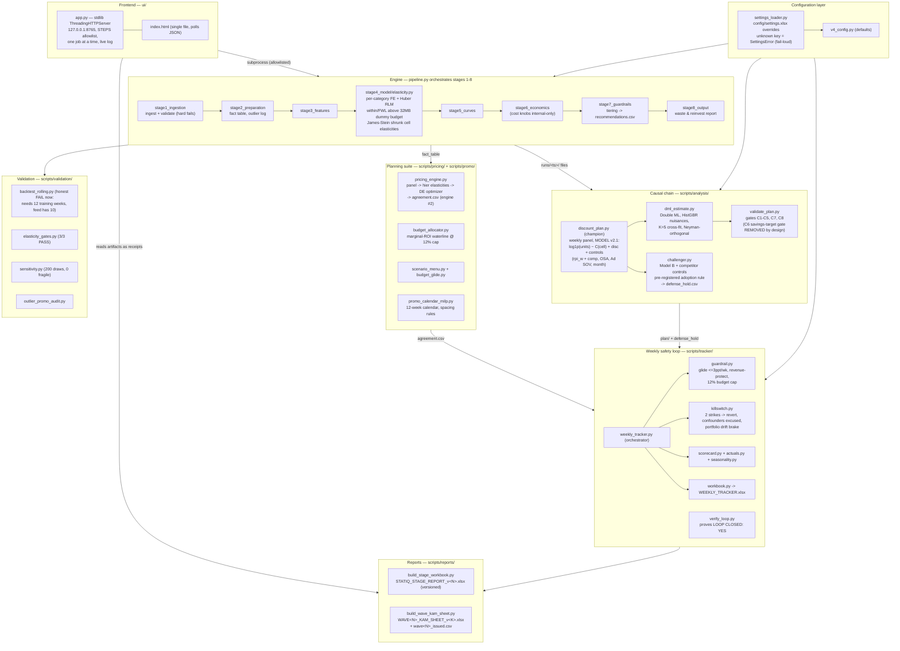

# Architecture — the components and how they hang together

*A file-based analytical engine with a thin local web front. No database,
no cloud, no services — the "architecture" is a disciplined arrangement of
Python modules around a shared filesystem contract.*

Sibling diagrams: [system-context](system-context.md) ·
[user-flow](user-flow.md) · [data-flow](data-flow.md) ·
[critical-workflows](critical-workflows.md) ·
Deeper prose: `docs/TECHNICAL/10-system-architecture.md`

---

## The business picture

```
SETTINGS (one Excel file, every knob)
   -> ENGINE (8 stages: clean -> model -> recommend)
   -> JUDGES (champion model + independent DML + C-gates + challenger)
   -> PLANNERS (pricing engine, budget, promo calendar, scenarios)
   -> SAFETY (weekly tracker: glide, caps, agreement, kill-switch)
   -> DELIVERABLES (versioned workbooks the KAM can execute)
   ... all watched from ONE local dashboard with live receipts
```

Layers only ever talk through files on disk. Any layer can be re-run alone;
the result is the same because the inputs are the same files.

## Technical component diagram



## Component responsibilities in one line each

| Component | Responsibility | Key files |
|---|---|---|
| Config | Every knob from a file; blank = default, unknown key = error | `settings_loader.py`, `v4_config.py`, `config/settings.xlsx` |
| Engine | Raw CSV → cleaned facts → elasticities → tiered recommendations | `pipeline.py`, `stage1_…`–`stage8_…` |
| Causal chain | Prove the waste is real: champion estimate, independent DML check, hard gates, competitor challenger | `scripts/analysis/` |
| Planning | Turn "true waste" into an executable plan: prices, budget, calendar, scenarios | `scripts/pricing/`, `scripts/promo/` |
| Safety loop | Small guarded weekly steps, self-scoring, automatic revert | `scripts/tracker/` |
| Validation | Attack the model: walk-forward, gates, perturbation, audit | `scripts/validation/` |
| Reports | Versioned, KAM-executable workbooks | `scripts/reports/` |
| Frontend | See + run everything locally; receipts from current-run files | `ui/app.py`, `ui/index.html` |

## Where classic architecture concepts map to

- **Database →** the filesystem contract: immutable `output/runs/<ts>/`
  folders plus the living `output/DISCOUNT_PLAN/` state directory. Joins
  happen in pandas; the join key is `product_id`/`cell_id`, present first
  in every table.
- **Service boundaries →** process boundaries. Each script is a standalone
  `python -X utf8 <script>` run from repo root; the UI composes them via
  subprocess with an allowlist, never imports them into its own process.
- **Deployment →** `launch_ui.bat` (or `.claude/launch.json` →
  `dashboard`). Python 3.12 venv at `.venv`, pinned `requirements.txt`.
- **Monitoring →** the receipts panel + `stage8_monitoring/` +
  `scripts/tracker/scorecard.py`; alerts are rows in files, not pages.
- **CI/CD →** none; local `pytest tests/ -m "not slow"` (67 pass) is the
  merge bar, and the validation suite is the release bar.

## Design decisions an engineer must not "fix"

1. **No savings target anywhere** — gate C6 was deliberately removed;
   the engine reports amounts + spend share, never grades sufficiency.
2. **No COGS/margin user-facing** — revenue-space ROI only; cost knobs
   feed guardrails internally.
3. **Versioned deliverables** — never overwrite a delivered workbook.
4. **Fail-loud everywhere** — bad settings or bad input stop the run with
   the offending key/column named; silence is the only forbidden outcome.
5. **Stale receipts are bugs** — every dashboard chip is recomputed from
   the current run's artifacts at request time.

## Legend

- **Champion / engine #2** — `discount_plan.py` and `pricing_engine.py`;
  a cut ships only where `agreement.csv` shows both engines agree.
- **FWL / within transform** — fitting fixed effects by demeaning within
  cell instead of building the dummy matrix; identical coefficients,
  bounded memory.
- **Receipt** — a pass/fail chip in the UI backed by a current-run file.
- **Allowlist** — the `STEPS` dict in `ui/app.py`; the complete set of
  things the frontend can execute.
