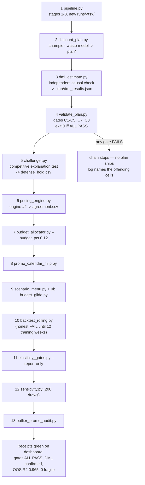
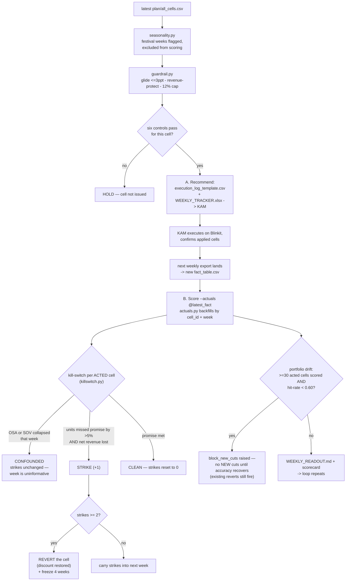

# Critical Workflows — monthly rebuild, weekly loop, wave tests

*The three workflows money actually rides on. Everything here is a button
in the dashboard (`ui/app.py` `STEPS`) or a dated file in
`output/DISCOUNT_PLAN/`.*

Sibling diagrams: [system-context](system-context.md) ·
[user-flow](user-flow.md) · [data-flow](data-flow.md) ·
[architecture](architecture.md)

---

## The business picture

```
MONTHLY:  new Blinkit export -> rebuild everything -> gates ALL PASS
          -> a defensible plan exists            (14 steps, one button)

WEEKLY:   plan -> small guarded step (max 3ppt) -> KAM executes
          -> next export scores it -> 2 bad weeks on a cell? AUTO-REVERT

WAVES:    can't-yet-prove cells -> issue a 2-3 week TEST at a set price
          -> monitor weekly units vs a pre-committed strike line
          -> confirmed? BANK it as a governed cut   missed twice? REVERT
```

---

## 1. The monthly rebuild

One click (`monthly_all`) runs 14 steps in `MONTHLY_ORDER`, strictly in
sequence; any non-zero exit stops the chain loudly.



The plan the weekly loop consumes is whatever the **latest run with a
`plan/` folder** contains — currently `output/runs/20260810_143823`
(699 cells, 8 categories).

---

## 2. The weekly loop (with the kill-switch branch)

`weekly_tracker.py` issues; the next week's export judges. Six controls
gate every issued move: two-engine agreement (`pricing/agreement.csv`),
`defense_hold.csv`, hero protection (`STRATEGIC_SKUS` in settings), glide
≤ 3 ppt/week, 12% budget cap, and the kill-switch below.



Only **acted** cells (applied, action cut/reinvest) are ever judged —
unacted holds carry no prediction, so they can neither strike nor pad the
drift denominator. `verify_loop.py` (button C) proves this whole circle
closes on historical data before real money rides on it.

---

## 3. The wave test lifecycle (issue → monitor → strike/confirm → bank or revert)

Cells the model *believes* but cannot yet prove (e.g. availability-
constrained history — 423/699 cells) are not cut; they are **tested**.
The Unlock Pipeline stakes Rs. 8.0 L/mo behind these experiments.

```mermaid
stateDiagram-v2
    [*] --> Issued : build_wave_kam_sheet.py\nWAVE1_KAM_SHEET_v&lt;K&gt;.xlsx +\nwave1_issued.csv (2026-08-16,\napply 2026-08-17 - 7 cuts + 15 tests)
    Issued --> Monitoring : KAM sets to_disc on the portal
    Monitoring --> Monitoring : weekly export scored vs\npred_units_wk / strike_units_wk\n(strike line = 95% of prediction)
    Monitoring --> Struck : units < strike_units_wk\n(miss > 5% tolerance)
    Struck --> Monitoring : next week back above line\n(strike carried, not fatal yet)
    Struck --> Reverted : 2nd weekly miss —\ntwo misses => revert
    Monitoring --> Confirmed : 2-3 clean weeks —\ncell's true response learned
    Confirmed --> Banked : promoted to GOVERNED CUT\nin the weekly tracker;\nsavings move from queue to confident
    Reverted --> [*] : discount restored;\nmodel updated with the\nlearned (negative) result
    Banked --> [*]
```

Mechanics worth knowing:

- **One workbook, two sections.** `build_wave_kam_sheet.py` merges
  Section A (governed cuts from `execution_log_template.csv` — permanent
  glide steps, both engines agreed) with Section B (wave tests — explicit
  experiments) so the KAM executes a single sheet on Monday.
- **The strike line is pre-committed.** Each issued row in
  `wave1_issued.csv` carries `pred_units_wk` (point prediction from the
  category coefficient's CI) and `strike_units_wk` = 95% of it (`TOL =
  0.95`, the tracker's own 5% tolerance). Success is defined *before* the
  test starts — no post-hoc grading.
- **The scorer closes the loop automatically.** `wave1_issued.csv` is the
  machine-readable issue log the weekly scorer reads when the next export
  lands; wave cells ride the same strike/confounder/revert machinery as
  governed cuts.
- **Banked ≠ re-modeled.** A confirmed wave cell doesn't just raise a
  number — it converts queued (test-gated) savings into the confident
  figure the brand is quoted, keeping the headline honest.

---

## Legend

- **Governed cut** — a permanent, glide-stepped discount reduction that
  passed all six controls (amber rows in the KAM sheet).
- **Wave test** — a 2–3 week experiment at a fixed discount with a
  pre-committed strike line (blue rows); issued to *learn*, not to save.
- **Strike** — a weekly miss >5% below promise *with* net-revenue loss,
  not excused by an OSA/SOV collapse. Two strikes revert the cell.
- **Confounded week** — OSA or SOV collapsed; the week proves nothing and
  the strike count is left untouched (neither reset nor incremented).
- **Bank** — promote a confirmed test into the governed weekly plan.
- **Drift brake** — portfolio-level stop on *new* cuts when scored
  hit-rate < 0.60 across ≥ 30 acted cells (`killswitch.py` defaults).
