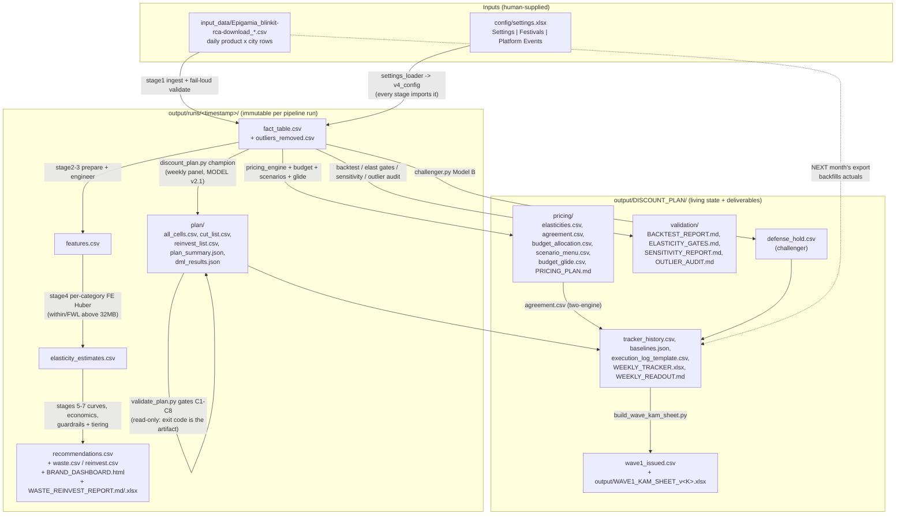

# Data Flow — three CSVs in, a priced shelf out

*Every artifact on disk, in the order it is produced. There is no database:
each box below is a real file you can open, and each arrow is a script that
reads the left file and writes the right one.*

Sibling diagrams: [system-context](system-context.md) ·
[user-flow](user-flow.md) · [architecture](architecture.md) ·
[critical-workflows](critical-workflows.md)

---

## The business picture

```
BLINKIT EXPORTS (3 monthly CSVs)
  -> CLEANED into one daily fact table (outliers logged, never silent)
  -> MODELED: how much does each cell really respond to discount?
  -> JUDGED:  which discounts are genuine waste vs stock/competitor noise?
  -> DOUBLE-CHECKED by an independent causal method (DML)
  -> GATED:   C1-C8 receipts, ALL PASS or no plan ships
  -> PLANNED: cut list + reinvest list + budget + promo calendar
  -> HANDED OFF weekly to the KAM in small, guarded steps
  -> SCORED next month when the new export lands
  -> RESULT: Rs. 90,402/mo confident waste identified, tracked to the rupee
```

## Technical data-flow diagram



## Stage-by-stage artifacts (`pipeline.py`)

| Stage | Module | Writes into `output/runs/<ts>/` |
|---|---|---|
| 1 Ingestion | `stage1_ingestion/` | (in-memory raw frame; `validate.py` hard-fails bad input) |
| 2 Preparation | `stage2_preparation/prepare.py` | `fact_table.csv`, `outliers_removed.csv` |
| 3 Features | `stage3_features/features.py` | `features.csv` |
| 4 Elasticity | `stage4_model/elasticity.py` | `elasticity_estimates.csv` |
| 5 Curves | `stage5_curves/curves.py` | (in-memory saturation curves) |
| 6 Economics | `stage6_economics/economics.py` | (in-memory; internal cost knobs are guardrail-only, never user-facing) |
| 7 Guardrails | `stage7_guardrails/guardrails.py` | `recommendations.csv` + `BRAND_DASHBOARD.html` |
| 8 Output | `stage8_output/waste_reinvest.py` | `WASTE_REINVEST_REPORT.md/.xlsx`, `waste.csv`, `reinvest.csv`, `per_cell_detail.json` |

Memory note: `pipeline.py` drops the raw all-brand frame right after stage 2
(the machine has ~1 GB free RAM), and stage 4 switches to the within/FWL
transform when the cell-dummy matrix would exceed 32 MB — identical
coefficients, a fraction of the memory.

## Contracts that keep the flow honest

- **Every generated table leads with `product_id` (+ `cell_id`)** so any row
  can be joined back to any other artifact.
- **Run folders are immutable**; the analysis chain always resolves "the
  latest run that has a `plan/`" by glob (`output/runs/2026*`), never a
  hardcoded path.
- **Receipts read current-run files.** The dashboard's DML chip parses
  `runs/<latest>/plan/dml_results.json` per request; `backtest_rolling.py`
  writes its FAIL report the same as a pass — a missing or stale receipt is
  a bug (see `ui/app.py`).
- **Delivered files are immutable history.** `STATIQ_STAGE_REPORT_v<N>.xlsx`
  and `WAVE<N>_KAM_SHEET_v<K>.xlsx` version up on every build
  (`_next_versioned_out` / `_next_out`), never overwrite.
- **No COGS or margin in any user-facing file.** Observable numbers only —
  revenue-space ROI; cost knobs exist solely inside guardrail logic.
- **`output/` is git-ignored except `DISCOUNT_PLAN/`** — the living plan
  state is tracked, bulk run artifacts are not.

## The loop-closing edge (dotted, above)

The weekly tracker appends this week's *predictions* to
`tracker_history.csv`. When the next Blinkit export arrives and a new
`fact_table.csv` exists, "B. Score" matches `cell_id` + week, backfills
*actuals*, and the kill-switch/scorecard judge every acted cell. Data flows
in a circle by design — the same file format that feeds the model also
grades it.

## Legend

- **Solid arrow** — a script run (monthly or weekly button) that reads left,
  writes right. **Dotted arrow** — next month's data closing the loop.
- **`runs/<ts>/`** — one immutable folder per `pipeline.py` invocation
  (latest: `20260810_143823`, 699 cells, 8 categories).
- **`DISCOUNT_PLAN/`** — the single living directory: tracker state,
  pricing suite, validation receipts, issued waves.
- **Champion / DML** — the two independent causal estimates that must agree
  before money moves; see [architecture](architecture.md).
