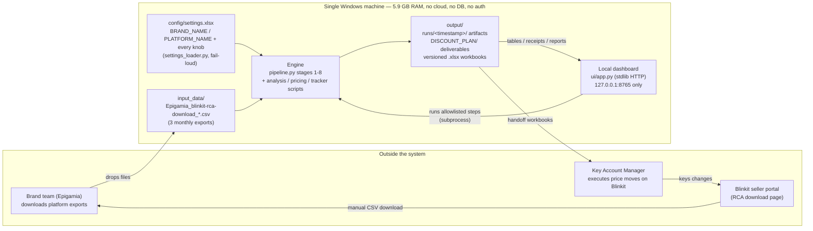

# System Context — Stat IQ Lab (Optimal Price Finder)

*Who and what touches the system, and where its boundaries actually are.
Verified against the live Epigamia-on-Blinkit engagement, run `20260810_143823`.*

Sibling diagrams: [user-flow](user-flow.md) ·
[data-flow](data-flow.md) · [architecture](architecture.md) ·
[critical-workflows](critical-workflows.md)

---

## The business picture

```
BRAND TEAM (Epigamia)                                    KAM at BLINKIT
      |                                                        ^
      | downloads monthly RCA export                           | executes cuts/tests
      v                                                        | on the portal
BLINKIT RCA CSVs ──> input_data/ ──> STAT IQ LAB ──> KAM HANDOFF SHEETS
                                    (one laptop,     (WEEKLY_TRACKER.xlsx,
                                     local files,     WAVE1_KAM_SHEET,
                                     local browser)   execution_log_template.csv)
                                          |
                                          v
                              NEXT MONTH'S EXPORT comes back in
                              ──> the loop scores its own predictions
```

One operator runs everything from a local dashboard. Nothing leaves the
machine; the only "integration" with Blinkit is a human downloading a CSV
and a human keying changes into the seller portal.

## Technical context diagram



## Boundaries — what exists and what deliberately does not

| Classic concept | Here |
|---|---|
| Database | **None.** Plain files: CSV/JSON/XLSX under `output/`, config in `config/settings.xlsx`. The "tables" are pandas DataFrames re-read from disk each run. |
| Cloud / deployment | **None.** Everything runs from the repo root on one machine (`python pipeline.py`, `launch_ui.bat`). There is no server to deploy to. |
| Auth / users | **None.** The dashboard binds to `127.0.0.1:8765` (`ui/app.py`); loopback binding *is* the access control. See `docs/TECHNICAL/17-security.md`. |
| External APIs | **None.** No network calls anywhere in the engine. The Blinkit "integration" is a human-carried CSV in and a human-executed price change out. |
| CI/CD | **None.** Verification is local: `pytest tests/ -m "not slow"` (67 passing) plus the in-repo validation suite (gates, backtest, sensitivity). |

## Actors

- **Operator / owner** — runs the monthly rebuild and the weekly loop from
  the dashboard (`launch_ui.bat` or the `dashboard` entry in
  `.claude/launch.json`), reviews receipts, sends the handoff.
- **Brand team (Epigamia)** — supplies the monthly RCA export; consumes the
  readouts and stage workbooks. Brand and platform are *settings*
  (`BRAND_NAME`, `PLATFORM_NAME` in `config/settings.xlsx`), never hardcoded.
- **KAM at Blinkit** — receives `WEEKLY_TRACKER.xlsx` /
  `WAVE1_KAM_SHEET_v*.xlsx`, executes the moves, confirms via the execution
  log. The KAM never touches the software.

## Data in / data out

**In:** `input_data/Epigamia_blinkit-rca-download_{May,June,July}_2026.csv` —
daily product × city rows (offtake, discount %, OSA %, SOV, MRP/selling
price, category share). Validated fail-loud by
`stage1_ingestion/validate.py` before anything runs.

**Out:** timestamped run folders `output/runs/<ts>/` (fact table, features,
elasticities, recommendations, plan), the living `output/DISCOUNT_PLAN/`
folder (tracker state, pricing suite, validation receipts, issued waves),
and versioned deliverables (`STATIQ_STAGE_REPORT_v5.xlsx`,
`WAVE1_KAM_SHEET_v2.xlsx`) that are never overwritten
(`scripts/reports/build_stage_workbook.py::_next_versioned_out`).

## Scale, for calibration

- 699 modeled product × city cells across 8 categories (latest run).
- ~1 GB free RAM shaped real code: stage 4 switches from a dummy-matrix FE
  fit to a within/FWL transform above a 32 MB budget
  (`stage4_model/elasticity.py::_FE_DUMMY_BUDGET_MB`), and `pipeline.py`
  frees the raw all-brand frame after stage 2.
- Current confident finding: Rs. 90,402/mo of DML-locked discount waste in
  7 Protein Milkshake cells; a further Rs. 8.0 L/mo sits in the test queue
  behind wave experiments.

## Cadence of the context

- **Monthly** — a new RCA export lands in `input_data/`; the operator runs
  the full rebuild (14 ordered steps) and receipts go green or the chain
  stops. See [critical-workflows](critical-workflows.md).
- **Weekly** — the tracker issues a guarded step to the KAM on Monday
  (wave 1 issued 2026-08-16 for the week of 2026-08-17: 7 governed cuts +
  15 wave tests) and scores the previous week when fresh data allows.
- **Per engagement** — swap `config/settings.xlsx` (brand, platform,
  hero SKUs, calendar) and drop the new brand's exports; no code changes.

## Legend

- **RCA export** — Blinkit's "root cause analysis" sales download; the sole
  raw input.
- **Cell** — one product_id × city pair; the unit every table is keyed on.
- **KAM** — key account manager; the human hands that touch Blinkit.
- **Receipts** — pass/fail chips the dashboard reads from the *current*
  run's artifacts (e.g. `plan/dml_results.json`); a stale receipt is
  treated as a bug, not a display quirk.
- Solid mermaid arrows are file or subprocess flows on the local disk;
  the only human-mediated hops are the two labeled manual ones.
