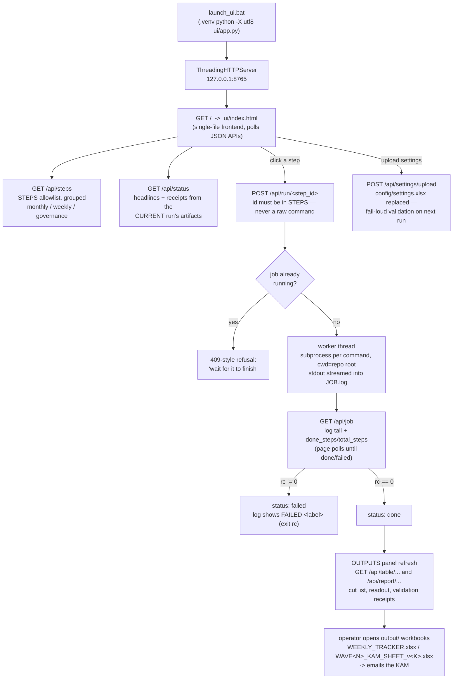

# User Flow — from launch to KAM handoff

*What the operator actually clicks, in order, and what each click produces.
The dashboard is the product's front door; every flow below is a button in
`ui/index.html` backed by the `STEPS` allowlist in `ui/app.py`.*

Sibling diagrams: [system-context](system-context.md) ·
[data-flow](data-flow.md) · [architecture](architecture.md) ·
[critical-workflows](critical-workflows.md)

---

## The business picture

```
USER double-clicks launch_ui.bat
  -> browser opens http://localhost:8765
  -> INPUTS panel: sees the 3 monthly CSVs + the settings that matter
  -> EXECUTE panel: presses ONE button
       monthly:  "Run full monthly rebuild"  (14 steps, in order)
       weekly:   "A. Recommend this week's cuts"
  -> watches live log + progress bar until ALL PASS
  -> OUTPUTS panel: headline number, cut list, receipts (green chips)
  -> picks up WEEKLY_TRACKER.xlsx / WAVE1_KAM_SHEET from output/
  -> sends it to the KAM  ->  RESULT: priced shelf + a scored prediction
```

No terminal needed. The buttons run the exact same scripts an engineer
would run by hand; the UI adds ordering, live logs and receipts.

## Technical flow diagram



## The three button groups (the whole UI surface)

**Monthly** (`monthly_all` runs all 14 in `MONTHLY_ORDER`):
`pipeline` → `champion` → `dml` → `gates` → `challenger` → `pricing` →
`budget` → `promo` → `scenarios` → `glide` → `backtest` → `elast_gates` →
`sensitivity` → `outlier_audit`. Ends with gates **ALL PASS** or a loud
failure in the log. Details: [critical-workflows](critical-workflows.md).

**Weekly**:
- **A. Recommend** — `scripts/tracker/weekly_tracker.py`; issues the KAM
  handoff (`output/DISCOUNT_PLAN/execution_log_template.csv` +
  `WEEKLY_TRACKER.xlsx`) under the six controls.
- **B. Score** — same tracker with `--actuals @latest_fact` (the UI
  resolves `@latest_fact` to the newest run's `fact_table.csv`); backfills
  what really happened, runs the kill-switch, updates the scorecard.
- **C. Self-test** — `scripts/tracker/verify_loop.py` proves
  `LOOP CLOSED: YES` on historical data, then the UI's `then:` hook resets
  tracker state and re-runs the tracker so the real weekly state is clean.

**Governance**:
- **Parameter review** — `scripts/tracker/params_review.py`; snapshots every
  decision knob and shows drift since the last sign-off.

## What the user sees after a run

- **Headline** — the confident monthly waste number (currently
  Rs. 90,402/mo, 7 cells, DML-locked) with spend-share context. By policy
  there is *no* savings target and *no* sufficiency grade anywhere in the
  UI — the engine reports amounts, the engagement judges them.
- **Receipts** — pass/fail chips (gates C1–C8, DML confirmation, OOS R²
  0.965, elasticity gates 3/3, sensitivity 0 fragile, backtest honestly
  FAIL until the feed reaches 12 training weeks). Each chip is computed
  from the *current* run's files at request time — e.g. the DML chip reads
  `output/runs/<latest>/plan/dml_results.json` — never from cached state.
- **Tables** — cut list, reinvest list, weekly readout, rendered from the
  same CSVs the workbooks are built from. Every table leads with
  `product_id` (+ `cell_id`) so rows can be looked up anywhere.

## Failure paths the flow is designed around

- A second click while a job runs is refused (`Job.lock`, one job at a time).
- A bad `config/settings.xlsx` raises `SettingsError` at import of
  `v4_config` — the step fails in the log with the offending key named,
  before any number is produced (`settings_loader.py`).
- A malformed input CSV is stopped by `stage1_ingestion/validate.py`
  (missing columns / no rows / <2 cells are hard failures).
- `POST /api/run/<anything-not-in-STEPS>` returns "Unknown step" — the UI
  cannot be talked into arbitrary commands.

## API surface behind the clicks (complete)

| Method + path | Backs |
|---|---|
| `GET /api/steps` | The button groups (labels, descriptions, order) |
| `GET /api/status` | Headlines + receipts panel |
| `GET /api/job` | Live log/progress poll during a run |
| `GET /api/settings`, `GET /api/settings/template` | Settings viewer + template download |
| `GET /api/table/...`, `GET /api/report/...` | Output tables and rendered reports |
| `POST /api/run/<step_id>` | Every execute button (allowlisted ids only) |
| `POST /api/settings/upload` | Replacing `config/settings.xlsx` |

That is the entire HTTP surface; see `docs/TECHNICAL/13-api.md` for
request/response shapes.

## Legend

- **Step id** — a key of the `STEPS` dict in `ui/app.py`; the only thing
  the run endpoint accepts.
- **Receipt / chip** — a small pass/fail badge on the OUTPUTS panel,
  recomputed per request from current-run artifacts.
- **`@latest_fact`** — UI-side placeholder resolved to
  `output/runs/<newest>/fact_table.csv` at run time.
- **Handoff** — the Excel file the KAM executes from; the last hop of every
  flow. See [data-flow](data-flow.md) for what's inside it.
